<p align="center">
  <picture>
    <source media="(prefers-color-scheme: dark)" srcset=".github/assets/logo-dark.svg">
    
  </picture>
</p>

<h1 align="center">TinyStore</h1>

<p align="center">
  A small storage runtime for applications.
</p>

<p align="center">
  <a href="LICENSE"></a>
  
  
</p>

---

> **Not released yet.** The engines below are built and tested; the API may
> still change, and no file written by an earlier revision has to be read.

TinyStore gives an application SQL, key-value state, durable jobs, files,
metrics and logs in one directory, with one lifecycle, one memory budget and
one backup. Go programs embed it. Bun and Python programs reach the same
directory through `tinystore serve`, a sidecar their SDK starts, and the same
protocol serves remote clients.

It is not a new database engine and does not try to beat specialised ones at
their own job. SQLite is underneath, with formats of its own where a workload
needs one. The goal is to make the storage of an application on one machine
boring to operate.

## A first look

```go
// errors left out
store, err := tinystore.Open(ctx, "./data", tinystore.Options{})
defer store.Close(ctx)

state, err := kv.Open(ctx, store, kv.Options{})
drafts, err := kv.OpenBucket[string](ctx, state, "drafts")
err = drafts.Set(ctx, "note/1", "hello")

queues, err := jobs.Open(ctx, store, jobs.Options{})
reminders, err := jobs.OpenQueue[Reminder](ctx, queues, "reminders")
err = reminders.Enqueue(ctx, Reminder{Note: 1}, jobs.After(time.Hour))
```

<details>
<summary><b>Bun</b></summary>

```ts
import { open } from 'tinystore'

await using store = await open('./data')

const drafts = store.kv.bucket('drafts', 'string')
await drafts.set('note/1', 'hello')

const reminders = store.jobs.queue<{ note: number }>('reminders')
await reminders.enqueue({ note: 1 }, { after: '1h' })
```

</details>

<details>
<summary><b>Python</b></summary>

```python
import asyncio
import tinystore

async def main() -> None:
    async with tinystore.open("./data") as store:
        drafts = store.kv.bucket("drafts", str)
        await drafts.set("note/1", "hello")

        reminders = store.jobs.queue("reminders", dict[str, int])
        await reminders.enqueue({"note": 1}, after=3600)

asyncio.run(main())
```

</details>

From the first release:

```sh
go get github.com/tinyshed/tinystore
bun add tinystore
pip install tinyshed-tinystore
```

Release packages will carry the `tinystore` binary for Linux, macOS and Windows.
[examples/notes](examples/notes/main.go) is a program using every engine.

## Engines

| | |
|---|---|
| [sqldb](sqldb/README.md) | the application's own SQL databases: tables from structs, checked migrations |
| [kv](kv/README.md) | current state: typed buckets, counters, expiry, versions |
| [jobs](jobs/README.md) | work that runs at its time: retries, leases, repeats |
| [blobs](blobs/README.md) | files by path, checked when read whole |
| [metrics](metrics/README.md) | samples kept bit for bit, answered exactly |
| [records](records/README.md) | logs and events, read by time, level and keys |
| [backup](backup/backup.go) | every engine's files in one checked zip |

By default each engine has its own file and writer. An application can put
jobs in its SQL database and commit a job with its rows in one `Batch`.

## Numbers

**TinyStore does not beat every specialized database at its own workload.
It makes the combined workload of a small application cheap enough that
replacing several services does not mean giving up performance.**

The application workload at 64 concurrent clients completes **81,531
requests/s locally** and **43,178 requests/s on an 8-vCPU Yandex VM**, median
of three passes. With jobs joined to the application's SQL file and written
in one `Batch`, that is **1.49x and 1.52x** the Redis + PostgreSQL +
VictoriaMetrics + files stack. Every pass of this configuration has zero
errors, dropped logs and jobs left waiting.

Two three-minute passes on the VM complete 35,151 and 35,169 requests/s,
**1.35x the service stack**, and handle every queued job. This is a bounded
sustained-load check, not a half-hour steady-state guarantee.

**TinyStore Batch** stores the queue in the application's SQL database and
commits its rows and job together. **TinyStore Split** uses the default jobs
file and commits each file independently.

<p>
<picture><source media="(prefers-color-scheme: dark)" srcset=".github/assets/bench-stack-dark.svg">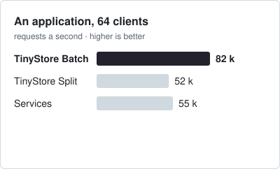</picture>
<picture><source media="(prefers-color-scheme: dark)" srcset=".github/assets/bench-stack-memory-dark.svg">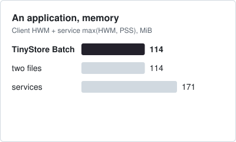</picture>
<picture><source media="(prefers-color-scheme: dark)" srcset=".github/assets/bench-kv-dark.svg">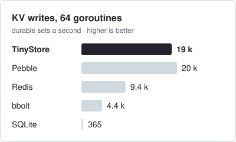</picture>
<picture><source media="(prefers-color-scheme: dark)" srcset=".github/assets/bench-sqldb-dark.svg">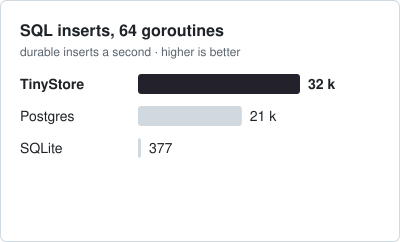</picture>
<picture><source media="(prefers-color-scheme: dark)" srcset=".github/assets/bench-records-dark.svg">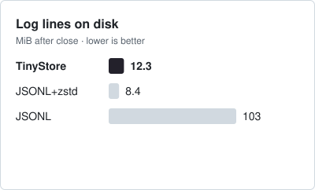</picture>
<picture><source media="(prefers-color-scheme: dark)" srcset=".github/assets/bench-metrics-disk-dark.svg">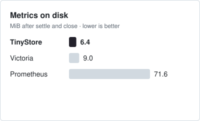</picture>
<picture><source media="(prefers-color-scheme: dark)" srcset=".github/assets/bench-metrics-memory-dark.svg">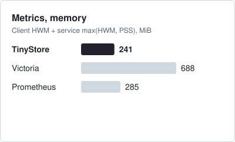</picture>
<picture><source media="(prefers-color-scheme: dark)" srcset=".github/assets/bench-metrics-ingest-dark.svg">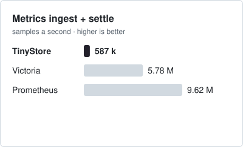</picture>
</p>

The cards use local Linux-container medians on a Ryzen 7 7700, 16 visible
CPUs, Go 1.27.1 and Docker Desktop 29.6.2. Records: 445,136 private production
lines. Metrics: 5,090,400 TSBS samples, with ingest plus settle timed together.
Memory is client high-water RSS plus the greater of service high-water RSS
and final service-tree PSS, not a simultaneous whole-stack peak.
Application memory covers the full 8/64/256-client run.
In the application memory card, the upper solid bar is idle and the lower
faded bar is the load peak from the same process run. That card uses a separate
three-pass, three-second round with service idle memory explicitly measured.
Its TinyStore row uses the Batch configuration.

These full-comparison processes also link the comparison libraries. Small,
independently linked consumers on the Yandex VM start at **3.4 MiB** for the
empty probe, **3.7 MiB** for `tinystore.Open` alone, **8.5-9.3 MiB** for one
engine and **14.9 MiB** for all six engines, without a loaded corpus.

**Raw binary** is an actual uncompressed TSBS export: an eight-byte timestamp
and eight-byte float value per sample, plus a JSON index with the series'
labels, offsets and counts. Its **78.2 MiB** includes both files and has been
checked bit for bit. It is a plain representation, not a database with
queries, retention or integrity checks.

### Bun and Python

<p>
<picture><source media="(prefers-color-scheme: dark)" srcset=".github/assets/bench-sdk-bun-get-dark.svg">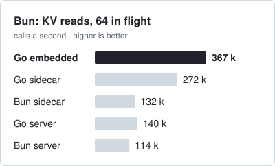</picture>
<picture><source media="(prefers-color-scheme: dark)" srcset=".github/assets/bench-sdk-bun-set-dark.svg">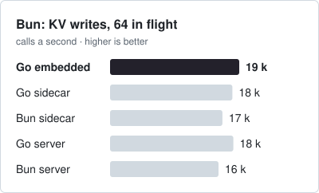</picture>
<picture><source media="(prefers-color-scheme: dark)" srcset=".github/assets/bench-sdk-python-get-dark.svg">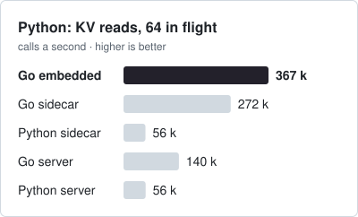</picture>
<picture><source media="(prefers-color-scheme: dark)" srcset=".github/assets/bench-sdk-python-set-dark.svg">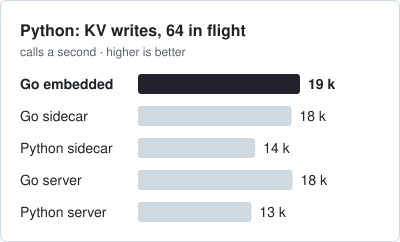</picture>
</p>

Embedded means a direct Go library call. Bun and Python use their SDKs through
a local sidecar or a loopback TCP server with a token; they have no embedded
mode. Go sidecar/server rows isolate the process boundary within one language;
SDK rows also include that language's encoding and scheduling. All modes use
the same 100,000 keys and 128-byte values, in one interleaved session.

These are workload comparisons, not universal wins: cloud KV writes did
not improve, specialized KV engines read faster, and Batch at 256 clients
leaves a growing jobs queue. Metrics competitors do not have identical
commit durability. The saved revisions, all passes, limits and reproduction
commands are in the [round report](https://github.com/tinyshed/research/blob/research/runtime-benchmarks/tinystore/reports/runtime-continuation-2026-10-01.md).
The report and these README figures are a branch draft until the measured
source is reviewed and merged.
The [consumer-memory and client-mode follow-up](https://github.com/tinyshed/research/blob/research/runtime-benchmarks/tinystore/reports/consumer-memory-2026-10-01.md)
records the small consumers, paired memory bars, raw representation and SDK modes.

The rounds, prototypes and open questions behind the design are in
[tinyshed/research](https://github.com/tinyshed/research/tree/main/tinystore).

## Origin

TinyStore started inside [Dashbin](https://github.com/tinyshed/dashbin), which
needed state, jobs, files and metrics without turning one self-hosted binary
into a set of services. Different workloads wanted different storage shapes,
but not different services, and the research grew into a project of its own.

## Development

TinyStore is developed with extensive AI assistance: its direction,
architecture and acceptance criteria are a person's, and coding agents do
much of the implementation, review and measurement. Generated code is not
evidence that anything works; the tests, fuzzers and reproducible
measurements are. [AGENTS.md](AGENTS.md) is the contract both follow.

## License

Apache-2.0.
