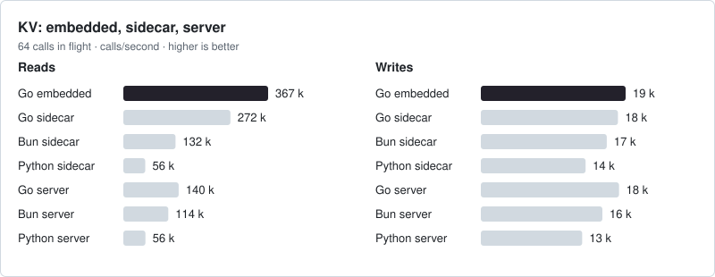

<p align="center">
  <picture>
    <source media="(prefers-color-scheme: dark)" srcset=".github/assets/logo-dark.svg">
    
  </picture>
</p>

<h1 align="center">TinyStore</h1>

<p align="center">
  A small storage runtime for applications.
</p>

<p align="center">
  <a href="LICENSE"></a>
  
  
</p>

---

> **Not released yet.** The engines are built and tested, and the packages
> below are published from the first release on. The API may still change, and
> no file written by an earlier revision has to be read.

TinyStore gives an application SQL, key-value state, durable jobs, files,
metrics and logs in one directory, with one lifecycle, one memory budget and
one backup. Go programs embed it. Bun, Node and Python programs reach the same
directory through `tinystore serve`, a sidecar their SDK starts, and the same
protocol serves remote clients.

It is not a new database engine and does not try to beat specialised ones at
their own job. SQLite is underneath, with formats of its own where a workload
needs one. The goal is to make the storage of an application on one machine
boring to operate.

<!--
The sample and the engines below are the landing page's: task readme writes
them from web/landing.md, and the site's tests fail when the two differ.
Change them there.
-->

## A first look

<!-- landing:sample -->

```go
// errors left out
store, err := tinystore.Open(ctx, "./data", tinystore.Options{})
defer store.Close(ctx)

db, err := sqldb.Open(ctx, store, "app", migrations, schema)
_, err = db.Exec(ctx, `insert into users (id, name) values (?, ?)`, 42, "Ada")

state, err := kv.Open(ctx, store, kv.Options{})
sessions, err := kv.OpenBucket[string](ctx, state, "sessions", kv.Sliding(30*24*time.Hour))
err = sessions.Of("42").Set(ctx, "token", "abc123")

queues, err := jobs.Open(ctx, store, jobs.Options{})
emails, err := jobs.OpenQueue[Email](ctx, queues, "emails")
err = emails.Enqueue(ctx, Email{To: "ada@example.com"})

objects, err := blobs.Open(ctx, store, blobs.Options{})
files, err := blobs.OpenBucket(ctx, objects, "files")
_, err = files.Put(ctx, "avatars/42.png", avatar)

logs, err := records.Open(ctx, store, records.Options{})
log := slog.New(logs.Handler("api"))
log.Info("user created", "userId", 42)

series, err := metrics.Open(ctx, store, metrics.Options{})
series.Counter("signups_total").Inc()
```

<details>
<summary><b>Bun</b></summary>

```ts
import { open } from 'tinystore'

await using store = await open('./data')

const db = await store.sql('app')
await db.exec`insert into users (id, name) values (${42}, ${'Ada'})`

const sessions = store.kv.bucket<string>('sessions', { sliding: '30d' })
await sessions.of('42').set('token', 'abc123')

const emails = store.jobs.queue<{ to: string }>('emails')
await emails.enqueue({ to: 'ada@example.com' })

const files = store.blobs.bucket('files')
await files.put('avatars/42.png', Bun.file('avatar.png'))

const log = store.records.logger('api')
log.event('user.created', { userId: 42 })

const signups = store.metrics.counter('signups_total')
signups.inc()
```

</details>

<details>
<summary><b>Python</b></summary>

```python
import asyncio
import logging
from pathlib import Path

import tinystore


async def main() -> None:
    async with tinystore.open("./data") as store:
        db = await store.sql("app")
        await db.exec("insert into users (id, name) values (?, ?)", 42, "Ada")

        sessions = store.kv.bucket("sessions", str, sliding="30d")
        await sessions.of("42").set("token", "abc123")

        emails = store.jobs.queue("emails", dict[str, str])
        await emails.enqueue({"to": "ada@example.com"})

        files = store.blobs.bucket("files")
        await files.put("avatars/42.png", Path("avatar.png").read_bytes())

        logging.getLogger().addHandler(store.records.handler("api"))
        logging.info("user created", extra={"user_id": 42})

        store.metrics.counter("signups_total").inc()


asyncio.run(main())
```

</details>

```sh
go get github.com/tinyshed/tinystore
bun add tinystore
pip install tinyshed-tinystore
```

<!-- /landing:sample -->

[examples/notes](examples/notes/main.go) is a complete program that uses every
engine, and [Getting started](docs/getting-started.md) builds a first one step
by step.

## Engines

<!-- landing:engines -->

| | | |
|---|---|---|
| [SQL](docs/sql/README.md) | Relational state | The application's own SQL databases: tables from structs, checked migrations. |
| [KV](docs/kv/README.md) | Application state | Current state: typed buckets, counters, expiry, versions. |
| [Jobs](docs/jobs/README.md) | Durable background work | Work that runs at its time: retries, leases, repeats. |
| [Blobs](docs/blobs/README.md) | Files and objects | Files by path, checked when read whole. |
| [Records](docs/records/README.md) | Logs and events | Read by time, level and keys. |
| [Metrics](docs/metrics/README.md) | Time series | Samples kept bit for bit, answered exactly. |

<!-- /landing:engines -->

By default each engine has its own file and its own writer. An application can
keep its jobs in its SQL database and commit a job together with its rows in
one `Batch`, as [Jobs and your data](docs/jobs/your-data.md) shows. One call
backs up every engine into one checked zip: see [Backups](docs/running/backups.md).

## Documentation

The [guides](docs/README.md) cover every engine, with a page per feature and
each example in Bun, Python and Go. Start with these:

- [Introduction](docs/introduction.md): what TinyStore is for and what it replaces
- [Getting started](docs/getting-started.md): install it and write a first program
- [Go, Bun and Python](docs/languages.md): how each language reaches a store
- [A tour](docs/tour.md): every engine on one page

For reference, see the [Bun and Node API](sdk/js/README.md), the
[Python API](sdk/python/README.md) and the [wire protocol](docs/wire.md).

## Looking at a store

The same binary shows a person, and an AI agent, what a store holds while its
application runs. Both SDK packages install it as the `tinystore` command:
`bunx tinystore …` and `uvx --from tinyshed-tinystore tinystore …` run it with
nothing else installed, and `go install
github.com/tinyshed/tinystore/cmd/tinystore@latest` builds it.

```sh
tinystore status ./data                            # each engine's bytes, and who serves the directory
tinystore logs ./data -f --level warn              # the application's logs, as they arrive
tinystore serve ./data                             # the directory's sidecar, until Ctrl+C
tinystore stop ./data                              # its server, once its work is finished
claude mcp add tinystore -- tinystore mcp ./data   # logs, kv, jobs and SQL for an agent, read only
```

[The command line](docs/running/cli.md) and [AI agents](docs/running/agents.md)
explain each command. The image `ghcr.io/tinyshed/tinystore` serves a store to
remote clients, as [A remote server](docs/running/server.md) shows.

## Numbers

**TinyStore does not beat every specialized database at its own workload.
It makes the combined workload of a small application cheap enough that
replacing several services does not mean giving up performance.**

The application workload at 64 concurrent clients completes **81,531
requests/s locally** and **43,178 requests/s on an 8-vCPU Yandex VM**, median
of three passes. With jobs joined to the application's SQL file and written
in one `Batch`, that is **1.49x and 1.52x** the Redis + PostgreSQL +
VictoriaMetrics + files stack. Every pass of this configuration has zero
errors, dropped logs and jobs left waiting.

Two three-minute passes on the VM complete 35,151 and 35,169 requests/s,
**1.35x the service stack**, and handle every queued job. This is a bounded
sustained-load check, not a half-hour steady-state guarantee.

**TinyStore Batch** stores the queue in the application's SQL database and
commits its rows and job together. **TinyStore Split** uses the default jobs
file and commits each file independently.

<p>
<picture><source media="(prefers-color-scheme: dark)" srcset=".github/assets/bench-stack-dark.svg"></picture>
<picture><source media="(prefers-color-scheme: dark)" srcset=".github/assets/bench-stack-memory-dark.svg"></picture>
<picture><source media="(prefers-color-scheme: dark)" srcset=".github/assets/bench-kv-dark.svg"></picture>
<picture><source media="(prefers-color-scheme: dark)" srcset=".github/assets/bench-sqldb-dark.svg"></picture>
<picture><source media="(prefers-color-scheme: dark)" srcset=".github/assets/bench-records-dark.svg"></picture>
<picture><source media="(prefers-color-scheme: dark)" srcset=".github/assets/bench-metrics-disk-dark.svg"></picture>
<picture><source media="(prefers-color-scheme: dark)" srcset=".github/assets/bench-metrics-memory-dark.svg"></picture>
<picture><source media="(prefers-color-scheme: dark)" srcset=".github/assets/bench-metrics-ingest-dark.svg"></picture>
</p>

The cards use local Linux-container medians on a Ryzen 7 7700, 16 visible
CPUs, Go 1.27.1 and Docker Desktop 29.6.2. Records: 445,136 private production
lines. Metrics: 5,090,400 TSBS samples, with ingest plus settle timed together.
Memory is client high-water RSS plus the greater of service high-water RSS
and final service-tree PSS, not a simultaneous whole-stack peak.
Application memory covers the full 8/64/256-client run.
In the application memory card, the upper solid bar is idle and the lower
faded bar is the load peak from the same process run. That card uses a separate
three-pass, three-second round with service idle memory explicitly measured.
Its TinyStore row uses the Batch configuration.

These full-comparison processes also link the comparison libraries. Small,
independently linked consumers on the Yandex VM start at **3.4 MiB** for the
empty probe, **3.7 MiB** for `tinystore.Open` alone, **8.5-9.3 MiB** for one
engine and **14.9 MiB** for all six engines, without a loaded corpus.

**Raw binary** is an actual uncompressed TSBS export: an eight-byte timestamp
and eight-byte float value per sample, plus a JSON index with the series'
labels, offsets and counts. Its **78.2 MiB** includes both files and has been
checked bit for bit. It is a plain representation, not a database with
queries, retention or integrity checks.

<details>
<summary><b>KV: embedded, sidecar and server benchmarks</b></summary>

<p>
<picture>
<source media="(prefers-color-scheme: dark) and (max-width: 600px)" srcset=".github/assets/bench-sdk-modes-mobile-dark.svg">
<source media="(max-width: 600px)" srcset=".github/assets/bench-sdk-modes-mobile-light.svg">
<source media="(prefers-color-scheme: dark)" srcset=".github/assets/bench-sdk-modes-dark.svg">

</picture>
</p>

Embedded means a direct Go library call. Bun and Python use their SDKs through
a local sidecar or a loopback TCP server with a token; they have no embedded
mode. Go sidecar/server rows isolate the process boundary within one language;
SDK rows also include that language's encoding and scheduling. All modes use
the same 100,000 keys and 128-byte values, in one interleaved session.

</details>

These are workload comparisons, not universal wins: cloud KV writes did
not improve, specialized KV engines read faster, and Batch at 256 clients
leaves a growing jobs queue. Metrics competitors do not have identical
commit durability. The cards measure `ad4f047`, before the exact block
summaries, which [a round of their own](https://github.com/tinyshed/research/blob/main/tinystore/reports/self-summary-2026-10-01.md)
measures. The saved revisions, all passes, limits and reproduction commands
are in the [round report](https://github.com/tinyshed/research/blob/main/tinystore/reports/runtime-continuation-2026-10-01.md).
The [consumer-memory and client-mode follow-up](https://github.com/tinyshed/research/blob/main/tinystore/reports/consumer-memory-2026-10-01.md)
records the small consumers, paired memory bars, raw representation and SDK modes.

The rounds, prototypes and open questions behind the design are in
[tinyshed/research](https://github.com/tinyshed/research/tree/main/tinystore).

## Origin

TinyStore started inside [Dashbin](https://github.com/tinyshed/dashbin), which
needed state, jobs, files and metrics without turning one self-hosted binary
into a set of services. Different workloads wanted different storage shapes,
but not different services, and the research grew into a project of its own.

## Development

TinyStore is developed with extensive AI assistance: its direction,
architecture and acceptance criteria are a person's, and coding agents do
much of the implementation, review and measurement. Generated code is not
evidence that anything works; the tests, fuzzers and reproducible
measurements are. [AGENTS.md](AGENTS.md) is the contract both follow.

## License

Apache-2.0.
